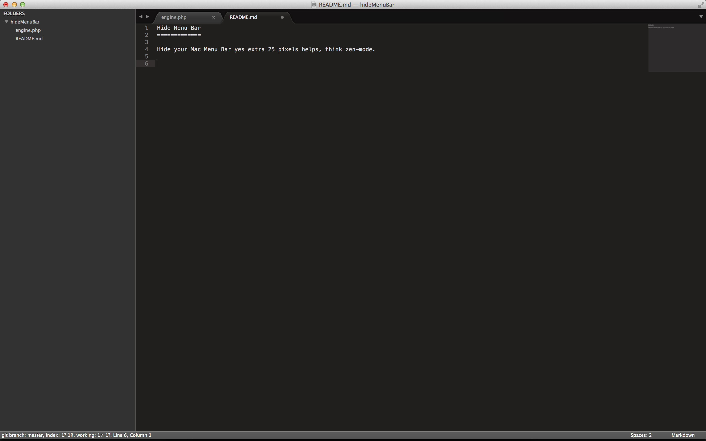

## Hide Menu Bar

Hide your Mac Menu Bar yes extra 25 pixels helps, think zen-mode.

### Usage
`sudo php engine.php APP_NAME_TO_HIDE_MENU_BAR_FOR [ARG]`

* `APP_NAME_TO_HIDE_MENU_BAR_FOR` parial app name to hide (eg., term, chrome)
* `ARG` if this is missing this will be a dry-run
  

vs.

